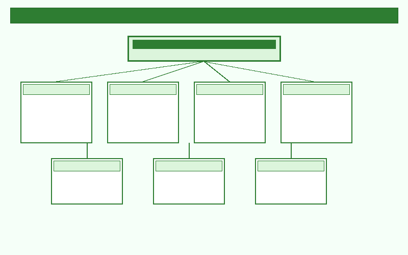

# 技术规格书：sys_pcie_eth_pwr_wrap 子系统

**版本**：0.5
**状态**：草稿（初步版）

---

## Figure List

- [图 1 顶层架构图](#fig-top-arch)
- [图 2 sys_hsio_pcie Bifurcation Fabric](#fig-pcie-fabric)
- [图 3 sys_hsio_hybrid Bifurcation Fabric](#fig-hybrid-fabric)
- [图 4 时钟架构图](#fig-clock)
- [图 5 复位架构图](#fig-reset)
- [图 6 Module Division](#fig-module-div)

## Table List

- [表 1 sys_hsio_pcie 控制器 Lane 分配](#tbl-pcie-lane)
- [表 2 sys_hsio_hybrid 控制器 Lane 分配](#tbl-hybrid-lane)

---

## 1. Introduction

`sys_pcie_eth_pwr_wrap` 是一个多协议端口聚合子系统，包含：

- 5 个 PCIe Controller
- 3 个 Ethernet Controller
- 2 个 X4 32G-PHY（物理层接口）
- 1 个 SMMU
- NOC 总线

主要特性：通过 Bifurcation 技术实现多个控制器对单个 PHY 的 lane 复用。

---

## 2. Feature List

### 2.1 PCIe 控制器特性

**适用**：全部 5 个 PCIe Controller

- **速率**：支持 Gen1 / Gen2 / Gen3 / Gen4 / Gen5，向下兼容，自动协商
- **双模式**：支持 Dual Mode（EP & RC），可配置
- **SR-IOV**：不支持
- **中断**：支持 MSI / MSI-X，支持Legacy Interrupt
- **Resizable BAR**：支持
- **iATU**：支持内部地址转换单元（Internal Address Translation Unit）
- **FLR**：支持功能级复位
- **Partial Reset**：每个 PCIe Link 支持独立 partial reset
- **Hot Reset**：支持软件控制延迟恢复机制
- **Virtual Channel**：支持 1 个 VC
- **Max Payload Size**：支持 256B
- **DMA Engine**：支持 8 通道（4 RX + 4 TX）DMA 引擎
- **功能安全**：支持，[TBD] 具体机制
- **AER**：支持高级错误上报
- **RAS DP**：支持 Data Protect 功能
- **ASPM**：支持 L0s, L1；不支持 L1.1 / L1.2 / L2
- **PCI-PM**：支持 PCI Power Management（D-state），链路可进入 L1
- **SRIS**：支持独立参考时钟
- **PTM**：支持精确时间测量
- **PIPE 接口**：支持 PIPE 4.4.1 规范
- **时钟结构**：PCLK 作为 PHY 输出时钟
- **热插拔**：不支持
- **ATS**：不支持地址转换服务

### 2.2 PHY Bifurcation

- **PHY 数量**：2 个 X4 32G-PHY
- **单 Lane 速率**：32 Gbps
- **bifurcation 粒度**：支持 x4 / x2 / x1 lane 拆分配置
- **跨协议共享**：支持 PCIe 与 Ethernet 跨协议 PHY 共享
- **配置方式**：上电初始化时通过寄存器配置 bifurcation 模式
- **Static Bifurcation**：Lane 分配在初始化阶段静态确定，运行期间不可动态切换

### 2.3 SMMU

- **功能**：系统存储管理单元，为 PCIe Controller 提供 DMA 地址转换
- **转换粒度**：[TBD]
- **支持特性**：[TBD]

---

## 3. Functional Description

### 3.1 Architecture

`sys_pcie_eth_pwr_wrap` 子系统采用 **PHY-centric** 拓扑结构，以两个 X4 32G-PHY 为核心，通过 bifurcation 交换网络实现多个控制器对 PHY lane 的灵活分配。

#### 3.1.1 顶层结构

**图 1 顶层架构图**

#### 3.1.2 组件互联

- **PCIe Controller**：5 个PCIe Controller和2个Ethernet Controller通过 bifurcation 连接到两个 PHY。控制器与 PHY 之间的 lane 映射在初始化阶段静态配置。
- **SMMU**：位于 所有 Controller 与 mnoc 之间，为所有 PCIe Controller 提供统一的 DMA 地址转换服务。每个 EP 发起的 DMA 事务经过 SMMU 转换为系统物理地址。
- **Ethernet Controller**：2 个  Ethernet Controller 固定连接到 sys_hsio_hybrid 的 Lane1/Lane2/Lane3。
- **NOC 总线**：包含两条独立总线。**hsio_bus** 由 snoc2hsio（下行）和 hsio2ring（上行）两条隔离通路组成；**hsio_sub_bus** 将 hsio2ring 数据通路拆分为 hsio2mnoc（DDR 地址空间）和 hsio2snoc（非 DDR 地址空间）。

#### 3.1.3 Bifurcation 架构

**sys_hsio_pcie** 的 bifurcation 交换网络：

**图 2 sys_hsio_pcie Bifurcation Fabric**

**sys_hsio_hybrid** 的 bifurcation 交换网络：

**图 3 sys_hsio_hybrid Bifurcation Fabric**

#### 3.1.4 数据路径

[TBD]

### 3.2 Clock and Reset

**图 4 时钟架构图**

**图 5 复位架构图**

### 3.3 Design Description

[TBD] 模块划分、hierarchy 等粗略描述

**图 8 Module Division**

### 3.4 Matrix

NOC 总线由两条独立的总线组成：

#### 3.4.1 hsio_bus

内部由两条完全隔离的通路构成：

- **snoc2hsio**：下行通路，负责系统 SNOC 到 HSIO 的数据传输
- **hsio2ring**：上行通路，负责 HSIO 到 ring_bus 的数据传输

#### 3.4.2 hsio_sub_bus

负责将 `hsio2ring` 的数据通路拆分为两部分：

- **hsio2mnoc**：地址范围为所有 DDR 空间
- **hsio2snoc**：地址范围为除去 DDR 地址空间外的其余所有地址空间

### 3.5 Sub-IPs

#### 3.5.1 APR

[TBD]

#### 3.5.2 XAF

[TBD]

#### 3.5.3 ecc_aggr

[TBD]

#### 3.5.4 CKM

[TBD]

#### 3.5.5 32g-PHY

[TBD]

#### 3.5.6 PCIe-Core

[TBD]

#### 3.5.7 SYS-ETH

[TBD]

#### 3.5.8 APB-BUS

[TBD]

### 3.6 IO Interfaces

[TBD]

### 3.7 Interrupt

[TBD]

### 3.8 Address Mapping

[地址映射表](./tables/address_mapping.xlsx)

---

## 4. Block Description

### 4.1 sys_hsio_pcie

**复用方式**：bifurcation（lane 拆分）

sys_hsio_pcie 的 lane 分配见下表。

**表 1 sys_hsio_pcie 控制器 Lane 分配**

| 控制器 | 通道分配 | 说明 |
| :--- | :--- | :--- |
| PCIe X4 Controller | Lane0~Lane3 | 使用全部 4 个 lane |
| PCIe X1 Controller | Lane2 | 与 X4 共享 lane |
| PCIe X1 Controller | Lane3 | 与 X4 共享 lane |

### 4.2 sys_hsio_hybrid

**复用方式**：bifurcation + 跨协议共享（PCIe + Ethernet）

sys_hsio_hybrid 的 lane 分配见下表。

**表 2 sys_hsio_hybrid 控制器 Lane 分配**

| 控制器 | 通道分配 | 说明 |
| :--- | :--- | :--- |
| PCIe X1 Controller | Lane0 | X1 模式使用 |
| ETH Controller #0 | Lane1 | XGMII-10G/5G |
| ETH Controller #1 | Lane2 | XGMII-10G/5G |
| ETH Controller #2 | Lane3 | XGMII-10G/5G |

### 4.3 SMMU

**功能**：系统存储管理单元，为 PCIe Controller 提供 DMA 地址转换

[TBD] 详细描述

### 4.4 NOC 总线

[TBD]

---

## 5. 待补充信息清单

- [ ] PHY 初始化与配置流程
- [ ] 低功耗策略（电源域、唤醒源）
- [ ] 功能安全具体实现（ECC、CRC、lockstep）
- [ ] 性能指标（吞吐、延迟）

---

## 6. 变更记录

| 版本 | 日期 | 变更内容 |
| :--- | :--- | :--- |
| 0.1 | [TBD] | 初始 PHY 映射 |
| 0.2 | [TBD] | 修正 phy_hybrid lane 分配 |
| 0.3 | [TBD] | 增加 PCIe/ETH 详细特性 |
| 0.4 | [TBD] | 按公司模板重组章节结构 |
| 0.5 | [TBD] | 调整 §3/§4 结构：Functional Description 分 5 小节，Block Description 承接 PHY 内容 |
| 0.6 | [TBD] | 补充 §3.1 Architecture 顶层结构、组件互联、bifurcation 交换与数据路径 |
| 0.7 | [TBD] | 新增 Figure List / Table List 章节，为所有图表添加锚点与交叉引用 |
| 0.8 | [TBD] | 子系统更名为 sys_pcie_eth_pwr_wrap，新增 NOC 总线组件与 Block Description |
| 0.9 | [TBD] | 补充 §4.4 NOC 总线：hsio_bus 与 hsio_sub_bus 结构描述 |
| 1.0 | [TBD] | 重组 §3 结构：3.3 Design Description、3.4 Matrix、3.5 Sub-IPs、3.6 IO Interfaces、3.7 Interrupt、3.8 Address Mapping；NOC 内容从 §4.4 移至 §3.4 Matrix |

---

**文档状态**：初步版，待后续迭代补充。
